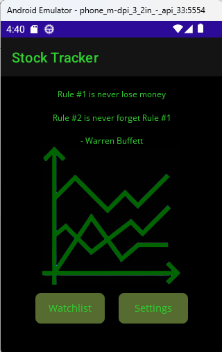
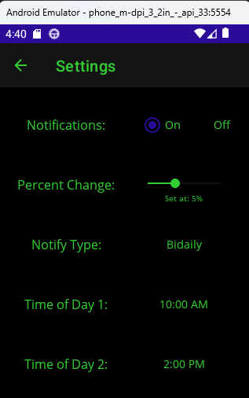
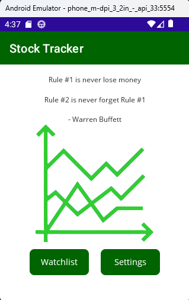
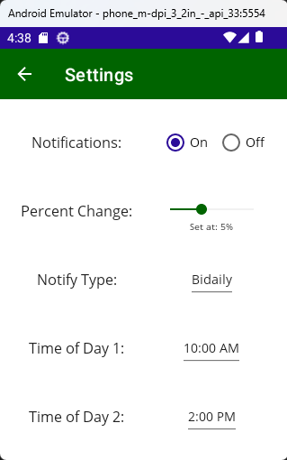
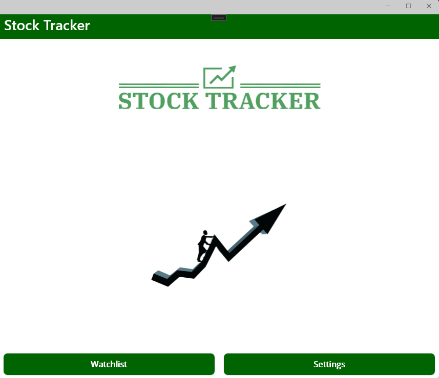
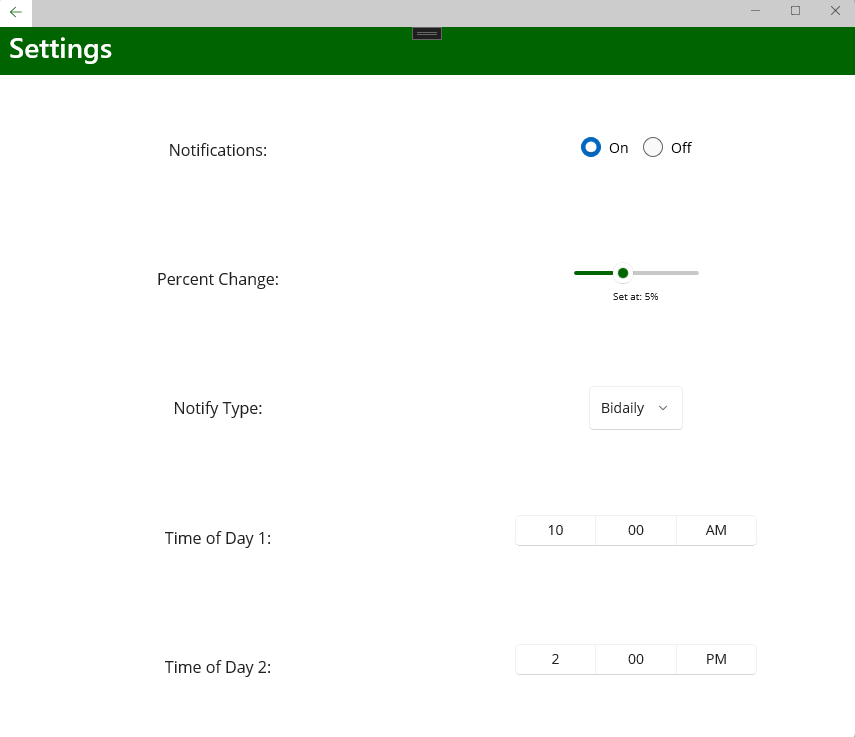
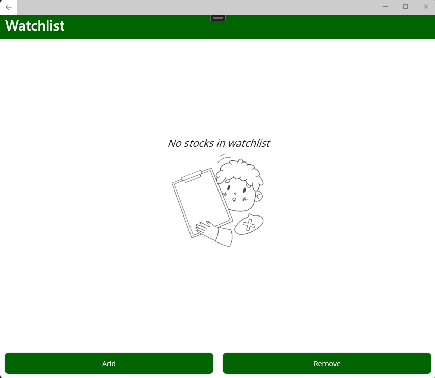
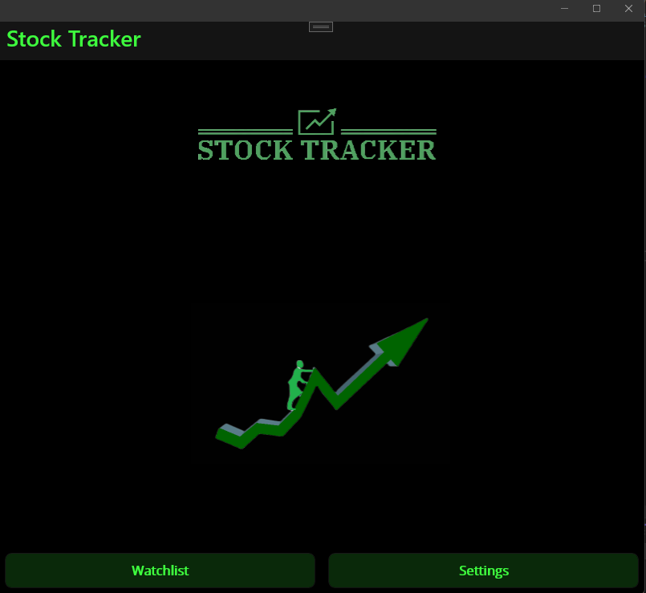
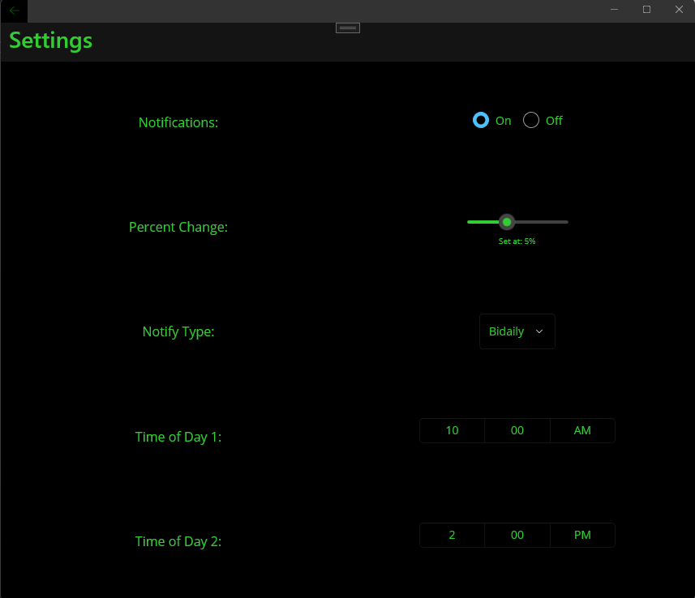
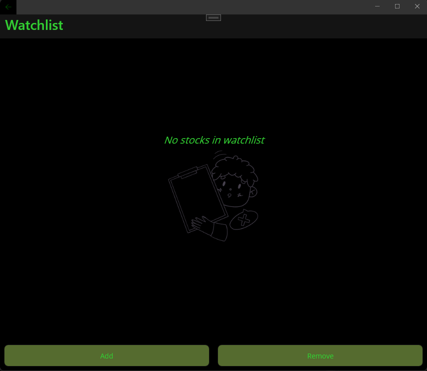

<h1 align='center'>Stock Tracker!</h1>

    Connects to the stock market and sends push notifications to the device when a stock
    within the watchlist changes value to the specifications of the user.

---

<!-- project images -->
<h2 align='center'>:camera: Project Images :camera:</h2>

***Available on Android, Windows, macOS and IOS***

<!-- android -->
<h3 align='center'>Android</h3>

<!-- android dark mode -->

<h4>Dark Mode&emsp;&emsp;&emsp;&emsp;&ensp;</h4>

 

<!-- android light mode -->

<h4>&emsp;&emsp;&emsp;&emsp;&ensp;Light Mode</h4>

 

    
:arrow_up: <a href="#stock-tracker">Back to top</a> :arrow_up:

<!-- windows -->
<h3 align='center'>Windows</h3>
<h4>Light Mode</h4>

<h4>Dark Mode</h4>

---

    
:arrow_up: <a href="#stock-tracker">Back to top</a> :arrow_up:

