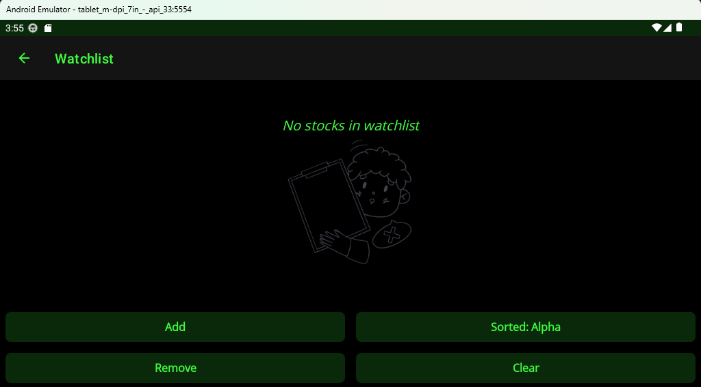

<h1 align='center'>:chart_with_upwards_trend: Stock Tracker! :chart_with_upwards_trend:</h1>

    Android application that connects to the stock market and creates local push notifications. Notifications include a list of stocks that have changed by a certain percentage for that day. Percentage threshold, notification times, and watchlist stocks are picked by the user.

---

<!-- how to download section -->
<h2 align='center'>:scroll: How To Download :scroll:</h2>

    Due to API GET Request restrictions from Twelve Data API, this app is for close friends/family and personal use and will not be available on the Google Play store, or available for download.

---

<!-- project images -->
<h2 align='center'>:camera: Project Images :camera:</h2>

***App Icon*** 

***Notification*** 

 

Jump To: 
[Android - Pixel Phone](#pixel-phone) 
[Android - Tablet](#tablet)

<!-- android -->
<h3 align='center'>Android OS</h3>

<h4 align='center'>Pixel Phone</h4>

<h4 align='center'>Tablet</h4>

    
:arrow_up: <a href="#chart_with_upwards_trend-stock-tracker-chart_with_upwards_trend">Back to top</a> :arrow_up:

    
:arrow_up: <a href="#chart_with_upwards_trend-stock-tracker-chart_with_upwards_trend">Back to top</a> :arrow_up:

